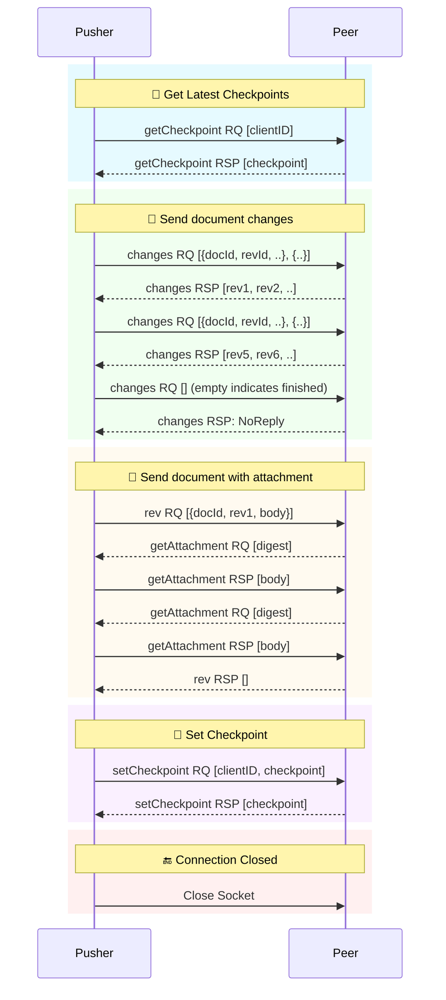
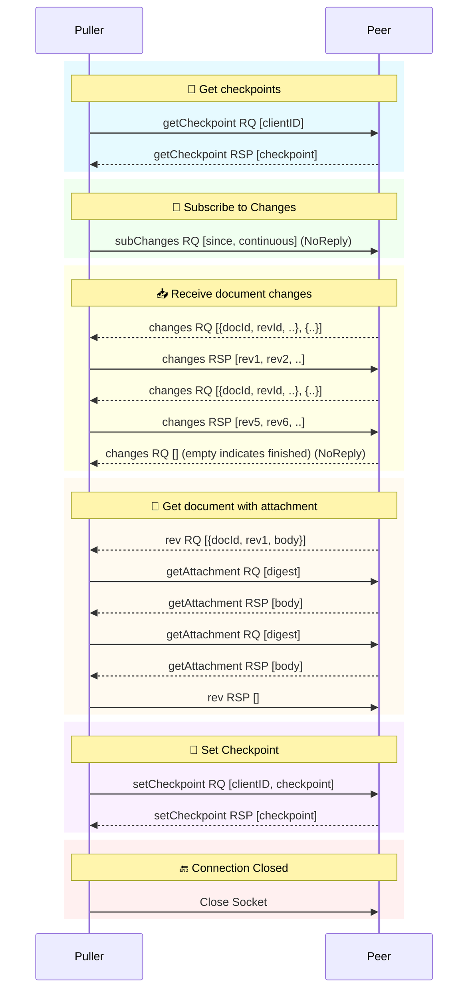

# Couchbase Mobile Replication Protocol

**Contributors:** Jens Alfke, Traun Leyden, Ben Brooks, Jim Borden

**Protocol version 4**; last updated Sept 16 2025

This document specifies the replication protocol in use by Couchbase Mobile
2.0 and later. It supersedes the REST-based protocol inherited from CouchDB.

## Contents

1. **[Connections and Messaging][Connections]**
2. **[RPC Messages][Messages]**
3. **[Versioning: Revision IDs, Histories, Sequences][Versioning]**
4. **[Checkpoints][Checkpoints]**
5. **[The Replication Algorithm][Algorithm]**

## 1. Connections and Messaging

The replication protocol uses bidirectional RPC messages. It’s built on the multiplexed [BLIP][BLIP] messaging protocol, which itself is layered on WebSockets.

Since both peers can send messages, the protocol isn’t *technically* “client/server”. Moreover, in peer-to-peer sync between Couchbase Lite devices, a single process might simultaneously play the client in one replication and the server in another! But in a single connection there *are* different roles for the client or “**active peer**” that initiated it, and the server or “**passive peer**” that accepted it.

> [!IMPORTANT]
> The active/passive distinction is not the same as pushing vs pulling. An active peer can both push and pull. From a passive peer’s perspective, it pushes revs as a response to a client-initiated pull, and vice versa.

### Connecting and Versioning

The client opens a WebSocket connection to the server at path
`/$dbname/_blipsync` (where `$dbname` is the name of the database.)
This begins as an HTTP UPGRADE request, and goes through authentication as
usual, then upgrades to WebSocket protocol.

The WebSocket sub-protocol name `BLIP_3+CBMobile_3`, sent in the
`Sec-WebSocket-Protocol` header, is used to ensure that both client and
server understand BLIP and the replicator protocol.

* `BLIP_3` refers to the version of the BLIP messaging protocol.
This has been quite stable over time.
* `CBMobile_3` refers to the major version of the replication protocol.
This increments when there are incompatible changes to the protocol,
and generally matches the major version of Couchbase Mobile itself.
* Smaller changes in the replication protocol are handled by adding
message properties or defining new messages. These are called out
individually; for instance, the changes to support scopes & collections
are marked with "*[3.1+]*".

> [!NOTE]
> As of this writing, protocol `CBMobile_4` is in development, for use by Couchbase Lite 4 and Sync Gateway 4. This version adds support for version vectors, as described in the [Versioning][Versioning] section.

### BLIP

BLIP is an RPC protocol invented at Couchbase. The [BLIP specification][BLIP] defines it in detail. At a high level, its characteristics are:

* Communication runs over a single TCP socket.
* Both client and server can send **messages** at any time. The protocol is symmetrical.
* Message delivery is reliable and ordered\*.
* Messages are multiplexed -- messages over a certain length are split into frames.
  Any number of messages can be in flight at once, and a large message does not block the ones behind it.
* A message is similar to an HTTP request in that it contains an unlimited-size binary body plus a set of key/value properties.
* An unsolicited message is called a **request**.
* A request can be responded to (unless marked as no-reply) and the **response** message can contain either properties and a body, or an error.

BLIP is capable of running over other transport protocols, for example Bluetooth, as long as they support ordered delivery of framed binary messages. (Couchbase Lite’s little-used MessageEndpoint allows apps to substitute their own transport.)

>  \* When messages are split into multiple frames, each message’s *first* frame arrives in the same order the messages were sent. However, a shorter message may be *completed* first even if it was sent after a longer one.

## 2. RPC Message Definitions

The two peers interact by sending RPC **request** messages and (usually) **responses**.

A request’s type is identified by its `Profile` property. The following
subsections are named after the `Profile` value of the request. Each begins by listing other defined properties and any meaning
assigned to the message body.

Any response properties and/or body data are listed too. However, many
messages don’t require any data in the response, just a success/failure
indication.

Message bodies are JSON by default.

Most of these messages are sent by both client and server. Their usage
in the replication algorithm is described in the **[Replication Algorithm][Algorithm]** section
below.

### Multi-Collection Support and the `collection` Property

Most of the request types described below have a `collection` property, which always has the same meaning. For compactness we’ll describe it here.

Protocol version 3.1 added support for **collections** and **scopes** while remaining backward compatible with older versions.

A client signals that it’s collection-aware by sending `getCollections` as its first message, instead of `getCheckpoint`. Once this message is sent the protocol is in **multi-collection mode**. Sending `getCheckpoint` instead signals **“legacy” mode** where only the default collection is synced. Once established, the mode cannot be changed.

The `getCollections` message also defines the ordered list of collections being synced, and allows a collection to be refered to by its zero-based index in that array, instead of by name.

The `collection` property, when present, is required in multi-collection mode and illegal in legacy mode. Its value is a number that indicates the collection to operate on for this message.

### Messages About Checkpoints

#### `getCheckpoint`

| Request             | Description                                                  |
| -------------------- | ------------------------------------------------------------ |
| `client`             | Unique ID of client checkpoint to retrieve                   |
| `collection` | Indicates the index of the collection to operate on for this message, indexed by the list resolved in `getCollections`.  If legacy `getCheckpoint` is used, this property **must** be omitted. *[3.1+]* |

Sent by the client to retrieve a checkpoint stored on the receiver. The checkpoint is a JSON
object that’s stored as the value of the key given by the `client`
property.  This property should be derived in a way that is collection
aware (i.e. each collection can have its own checkpoint).

If this message is sent before `getCollections` then the replication will operate in legacy mode and only the default collection can be replicated; see Multi-Collection Support.

> [!NOTE]
> A collection-aware client may still have a need to send `getCheckpoint` requests. One case is if a `setCheckpoint` fails, which means it’s somehow gotten out of sync with the version stored on the server. To recover from this it needs to read the server checkpoint to discover the current `rev` property.

| Response             | Description                                                  |
| -------------------- | ------------------------------------------------------------ |
|`rev`| The opaque MVCC revision ID of the checkpoint (_not_ the same as a document revID!) |
| Body | JSON data of the checkpoint, as given by the client in an earlier `setCheckpoint` message |

#### `getCollections` *[3.1+]*

| Request             | Description                                                  |
| -------------------- | ------------------------------------------------------------ |
| Body | JSON dictionary: `{"collections": [...], "checkpoint_ids": [...]}` |

A collection-aware parallelized version of `getCheckpoint`.  If this message is sent before any `getCheckpoint` calls then replication will operate in 3.1+ mode, which can fully handle collections; see Multi-Collection Support.

Each item in the `collections` array is a string of the format `scope.collection` , or simply `collection` implying the default scope.

Each item in the `checkpoint_ids` array is the client ID string to use when looking up the corresponding checkpoint. (The two arrays MUST thus be of the same length.)

| Response      | Description                                                  |
| -------------------- | ------------------------------------------------------------ |
| Body | A JSON array of checkpoint values |

The values in the response array will be ordered according to the order in the request message. Their interpretation is:

- A non-empty object is a saved checkpoint, plus the added property `_rev` whose value is the revision ID.
- An empty object (`{}`) means that there is no existing checkpoint for the given client ID.  
- `null` means that the collection does not exist in the remote, and the replication SHOULD NOT proceed.

#### `setCheckpoint`

| Request             | Description                                                  |
| -------------------- | ------------------------------------------------------------ |
|`collection`| Index of the collection to operate on for this message. *[3.1+]* |
|`client`| Unique ID of client checkpoint to store; opaque to the recipient |
|`rev`| Last known MVCC revision ID of the checkpoint _(omitted if this is a new checkpoint)_|
|Body| JSON data of checkpoint|

Sent by the client to store a checkpoint on the receiver. The JSON object in the request body
is associated with the key given in the `client` property. If the `rev`
value does not match the checkpoint’s current MVCC revision ID, the
request fails. 

On success, a new revision ID is generated and returned
in the response for use in the next request.

The response SHOULD NOT be sent until the new checkpoint has been stored durably.

| Response             | Description                                                  |
| -------------------- | ------------------------------------------------------------ |
|`rev`| New MVCC revision ID of the checkpoint|

## Messages About Changes

#### `subChanges`

| Request             | Description                                                  |
| -------------------- | ------------------------------------------------------------ |
|`activeOnly`| Set to `true` if the requestor doesn’t want to be sent tombstones. _(optional)_|
|`batch`| Maximum number of changes to send in a single `change` message _(optional)_|
|`collection`| Index of the collection to operate on for this message. *[3.1+]* |
|`channels`| If `filter` is `sync_gateway/by_channel`, this is a comma-delimited list of channel names to filter documents. (optional)|
|`continuous`| Set to `true` if the requestor wants change notifications to be sent indefinitely _(optional)_|
|`filter`| The name of a filter function known to the recipient _(optional)_|
|`future`| If `true`, send only changes that occur after the request is received. Overrides the `since` property. _(optional)_|
|`requestPlus`| If `true` and a non-continuous replication, be sure to wait for all changes that exist at the time of the request and might not be cached. (optional) |
|`revocations`| Set to `true` if the requestor wants to be notified of documents whose access has been revoked. _(optional)_ |
|`sendReplacementRevs`| If `true`, the recipient SHOULD send replacement revs rather than `norev` when the body of a requested rev is unavailable and a newer revision is available. _(optional)_ |
|`since`| Latest sequence ID already known to the requestor, JSON-encoded _(optional)_|
|`versioning`| `rev-trees` (default) or `version-vectors` — see the [Versioning][Versioning] section. *[4.0+]*. This value is ignored by Sync Gateway, and protocol `BLIP_3+CBMobile_3` will receive revtrees and `BLIP_3+CBMobile_4` will receive version vectors. |
|_other properties_| Named parameters for the filter function _(optional)_|
|Body| `{“docIDs”: […]}` _(optional)_ |

Sent by the client. Asks the server to begin sending `changes` messages starting from the
sequence just after the one given by the `since` property, or from the
beginning if no `since` is given.  If a collection index is provided, that collection’s changes are used.  Otherwise, the default collection will be used if possible.

The recipient MUST agree to the requested versioning type and use the corresponding syntax
for revIDs and revision histories in its messages.
If it cannot, it MUST respond with an error and close the connection.

The optional `filter` parameter names a filter function known to the
recipient that limits which changes are sent. If this is present, any
other properties to the request will be passed as parameters to the
filter function. The Sync Gateway only recognizes the filter
`sync_gateway/bychannel`, which requires the parameter `channels` whose
value is a comma-delimited set of channel names.

If a request body is present, it MUST be a JSON dictionary/object. In
this dictionary the key `docIDs` MAY appear; its value MUST be an array
of strings. If present, the recipient MUST only send changes to
documents with IDs appearing in that array. Other unrecognized keys in
the dictionary MUST be ignored.

> [!IMPORTANT]
> The changes are _not_ sent as a response to this request, rather as a
> series of `changes` messages, each containing information about zero or
> more changes. These are sent in chronological order. Once all the existing changes have been sent, the end is signaled via an
> empty `changes` message. Ordinarily, that will be the last message sent.
> However, if the `continuous` property was set, the recipient will continue to send `changes` messages whenever new
> changes are made to its collection, until the connection is closed.

#### `changes`

| Request             | Description                                                  |
| -------------------- | ------------------------------------------------------------ |
|`collection`| Index of the collection to operate on for this message. *[3.1+]* |
|Body| JSON array of arrays, one per document changed |

Can be sent by either peer, but usually only the server. Notifies the recipient of a series of changes made to either the sender’s default collection, or the collection specified by the provided index.  A passive replicator (server) is triggered to send
these by a prior `subChanges` request sent by the client. An active
replicator (client) will send them spontaneously as part of a
push replication.

The changes are encoded in the message body as a JSON array with one
item per change. A message with zero
changes signifies that delivery has "caught up" and all existing
sequences have been sent. This may be followed by more changes as they
occur, if the replication is continuous.

Each change in the array is encoded as a nested array of the form
`[sequence, docID, revID, deleted]`, i.e. sequence ID followed by
document ID followed by [revision ID][Versioning] followed by the deletion state
(which can be omitted if it’s `false`.)

The sequence IDs MUST be in forward chronological order but are
otherwise opaque (and may be any JSON data type, not just integers.)

`deleted` is normally either 1 or missing, but can have other values:

- 2 means access to this document has been revoked by the server
- 4 means the document was removed from all channels the user has access to

Either of those can be OR'ed with 1 to indicate that the document is also deleted,
i.e. a tombstone revision is available. If not, the receiver should purge the document.

The document body size in bytes MAY be appended to the array as a
fifth item if it’s known. (This is understood to be approximate, since
the sender’s database may not store the body in exactly the same form
that will be transmitted.)

The sender SHOULD break up its change history into multiple `changes`
messages instead of sending them in one big message. (It SHOULD honor
the optional `batch` parameter in the `subChanges` request it received
from the peer.) It SHOULD use flow control by limiting the number of
`changes` messages that it’s sent but not received replies to yet.

A peer in conflict-free mode (such as Sync Gateway) SHOULD reject a received `changes` message
by returning a BLIP/409 error. This informs the sender that it should
use `proposeChanges` instead.

> [!NOTE] 
> LiteCore always sends `proposeChanges` rather than `changes`;
> If LiteCore pushed a conflict via the `changes` endpoint, it would end up
> pulling in the other branch of the conflict soon thereafter, and CBL
> would resolve it and push the merge.

| Response             | Description                                                  |
| -------------------- | ------------------------------------------------------------ |
|`maxHistory`| Max length of revision history to send _(optional; not used with version vectors)_|
|Body| JSON array, one item per change |

The response message indicates which revisions the recipient wants to
receive (as `rev` messages). Its body is also a JSON array; each item
corresponds to the revision at the same index in the request. The item
is either:

* an array of strings, where each string is the revision ID of an
already-known ancestor. (This may be empty if no ancestors are known.)
This is used to shorten the revision history to be sent with the
document, and may in the future be used to enable delta compression.
* or a `0` (zero) or `null` value, indicating that the corresponding
revision isn’t of interest.

Trailing zeros or nulls can be omitted from the response array, so in
the simplest case the response can be an empty array `[]` if the
recipient isn’t interested in any of the revisions.

The `maxHistory` response property, if present, indicates the maximum
length of the `history` array to be sent in `rev` messages (see below.)
It should be set to the maximum revision-tree depth of the database. If
it’s missing, the history length is unlimited.

#### `proposeChanges`

| Request             | Description                                                  |
| -------------------- | ------------------------------------------------------------ |
|`collection`| Index of the collection to operate on for this message. *[3.1+]* |
|`conflictIncludesRev`| If `true`, requests that the peer include its current revID in a 409 response to a document *[optional]* |
|Body| JSON array of arrays, one per document changed |

Can be sent by either peer, but usually only the client. Sends proposed changes to a server that’s in conflict-free mode. The difference is that a form of MVCC is used: each change must be accompanied by the document’s last-known revision ID present on the server. If that ID does not match the document’s current server revision, the change is rejected; the client is expected to pull the server’s current version, resolve any conflicts, and retry.

The per-document changes in the body array are
different than in the `changes` message: they look like `[docID, revID, serverRevID]`. Each still
represents an updated document, but last item is the  revisionID of the last known
server revision (if any). If there is no known server revision, the
`serverRevID` SHOULD be omitted, or otherwise MUST be an empty string.
(As with `changes`, the estimated body size MAY be appended, if the
`serverRevID` is present.)

The recipient SHOULD then look through each document in its relevant collection. If
the document exists, but the given `serverRevID` is not known or not
current, the proposed document SHOULD be rejected with a 409 status (see
below.) Or if the document exists and the revID is current or obsolete, the server
already has the document and SHOULD reject it with a 304 status. The
recipient MAY also detect other problems, such as an illegal document
ID, or a lack of write access to the document, and send back an
appropriate status code as described below.

| Response             | Description                                                  |
| -------------------- | ------------------------------------------------------------ |
|Body| JSON array of status numbers |

The response message indicates which of the proposed changes are allowed
and which are out of date. It consists of an array of numbers, generally
with the same meanings as HTTP status codes, with the following specific
meanings:

* 0: The change is allowed and the peer should send the revision
* 304: The server already has this revision, so the peer doesn’t need to send it
* 409: The `serverRevID` property does not match the document’s current revID, so this change would cause a conflict, and the client needs to resolve it and retry later. If the request included `conflictIncludesRev`, this status SHOULD be upgraded from a number to an object of the form `{“status”: 409, “rev”: “…”}` where the value of `rev` is the document’s current revID.

As with `changes`, trailing zeros can be omitted, but the interpretation
is different since a zero means "send it" instead of "don’t send it". So
the common case of an empty array response tells the sender to _send_
all of the proposed revisions.

### Messages About Revisions and Attachments

#### `rev`

| Request             | Description                                                  |
| -------------------- | ------------------------------------------------------------ |
|`collection`| Index of the collection to operate on for this message. Required in *[3.1+]* |
|`id`| Document ID _(optional)_|
|`rev`| Revision ID _(optional)_ -- see the [Versioning][Versioning] section. |
|`replacedRev`| If the revision sent is not the revision originally requested, but is a replacementRev, this is the originally requested Revision ID. _(optional)_|
|`deleted`| `1` or `true` if the revision is a tombstone _(optional)_|
|`sequence`| Sequence ID, JSON-encoded _(optional unless unsolicited, q.v.)_. If this is a replacementRev, this will be the sequence of the original requested rev.|
|`history`| Revision history (list of revision IDs) -- see the [Versioning][Versioning] section. |
|`revTree`| If using version vectors, this is the full revision tree of the same document, and will replace the revision tree history on the recipient. (optional)  *[4.0+]* |
|`noconflicts`| `true` if the revision may not create a conflict _(optional; default is false)_ |
|`deltaSrc`| The revisionID that the body is a JSON delta from. If not included, the body is a complete revision. _(optional)_ |
|Body| Document JSON|

Sent by either peer. Sends one document revision, either meant for the specified collection or the default collection if one is not specified. 

The `id`, `rev`, `deleted` properties are
optional if corresponding `_id`, `_rev`, `_deleted` properties exist in
the JSON body (and vice versa.) The `sequence` property is optional
unless this message was unsolicited. 

If the `noconflicts` flag is set, or if the recipient is in conflict-free mode,
it MUST check whether the `history` array contains the current local revision ID,
or if the `history` array is empty and the document does not exist locally.
If not, it MUST reject the revision by returning a 409 status.

##### Unsolicited `rev`s

Ordinarily a `rev` message is triggered by receiving a response to a
`changes` message. However, it MAY be sent unsolicited if all of the following are true:

* This revision’s metadata hasn’t yet been sent in a `changes` message;
* this revision’s sequence is the first one that hasn’t yet been sent in a `changes` message;
* the revision’s JSON body is small;
* and the sender believes it’s very likely that the recipient will want
this revision (doesn’t have it yet and is not filtering it out.)

In practice this is most likely to occur for brand new changes being
sent in a continuous replication in response to a local database update
notification.

##### Response

The recipient MUST send a response unless the request was sent
'noreply'. It MUST not send a success response until it has durably
added the revision to its database, or has failed to add it. On success
the response can be empty; on failure it MUST be an error.

The sender MAY send the message as ‘noreply’ if there are no attachments, `deltaSrc` is not present, and it doesn’t care whether the recipient was able to save the revision. (The latter is typically true of servers but not clients!)

> [!IMPORTANT]
> The recipient may need to send one or more `getAttachment` messages
> while still processing the `rev` message, in which case it MUST NOT send the
> `rev`’s response until it’s received responses to the `getAttachment`
> message(s) and durably added the attachments, as well as the document,
> to its database.

#### `norev`

| Request             | Description                                                  |
| -------------------- | ------------------------------------------------------------ |
|`collection`| Index of the collection to operate on for this message. *[3.1+]* |
|`id`| Document ID _(optional)_|
|`rev`| Revision ID _(optional)_|
|`sequence`| Sequence ID, JSON-encoded _(optional)_|
|`error`| The error number, which should correspond to HTTP Response status codes|
|`reason`| A more detailed description of the cause of the error _(optional)_|
|Body| None|

Sent by either peer. Informs the recipient that the sender no longer has a revision it promised in an earlier `changes` or `proposeChanges` message, after the recipient indicated in its response that it wanted that revision. This prevents the peer
from waiting for a `rev` message that will never come, which could cause
the replication to get stuck. This message SHOULD be sent as `noreply`.

**However**, if the recipient had earlier included the `sendReplacementRevs` property (set to true) in its `subChanges` message, and the sender has a newer revision of the document, it should still send a `rev` message containing the newer revision, but set the `replacedRev` property to the original revID.

#### `getAttachment`

| Request             | Description                                                  |
| -------------------- | ------------------------------------------------------------ |
|`collection`| Index of the collection to operate on for this message. *[3.1+]* |
|`digest`| Attachment digest (as found in document `_attachments` metadata.)|

Sent by either peer. Requests the body of an attachment, given its digest. This is sent by
the recipient of a `rev` message if it determines that the revision
contains an attachment whose contents it does not have (i.e. its `digest` property does not match that of any known attachment.)

> [!NOTE]
> This request is problematic: it assumes that the recipient indexes
> attachments by digest, which is true of Couchbase Mobile but not
> necessarily of other implementations. Adding the document and revision
> ID to the properties would help.

##### Security

If the recipient’s database has per-document access control, where
documents may be readable by some but not all users, it MUST check that
an attachment with this digest appears in at least one document that the
client has access to. Otherwise a client could violate access control by
getting the body of any attachment it can learn the digest of (probably
"leaked" by another user who does have access to it.) 

The simplest way
to enforce this is for the server to keep track of which `rev` messages
it’s sent to the client but not yet received responses to; these are the
ones that the client will be requesting attachments of, to complete its
downloads.

| Response             | Description                                                  |
| -------------------- | ------------------------------------------------------------ |
|Body| Raw binary data of the attachment.|

#### `proveAttachment`

| Request             | Description                                                  |
| -------------------- | ------------------------------------------------------------ |
|`collection`| Index of the collection to operate on for this message. *[3.1+]* |
|`digest`| Attachment digest (as found in document `_attachments` metadata.)|
|Body| A _nonce_: 16 to 255 bytes of random binary data (not JSON!) |

Sent only by Sync Gateway. A cryptographic challenge that asks the recipient to prove that it has the body of the attachment with
the given digest, without making it actually send the data. 

This is another security precaution that SHOULD used by servers with
per-document access control, i.e. where documents may be readable by
some but not all users. If this weren’t in place, a user who knew the
digest (but not the contents) of an an attachment could upload a
document containing the metadata of an attachment with the same digest,
and then immediately download the document and the attachment.

Such a server SHOULD send this request when it receives a `rev` message
containing an attachment digest that matches a known attachment. 
The server first generates some cryptographically-random bytes (20
is a reasonable number) as a `nonce`, and sends the nonce along with the
attachment’s digest in a `proveAttachment` request to the client.

The recipient (the client, the one trying to push the revision) computes
a SHA-1 digest of the concatenation of the following:

1. The length of the nonce (a single byte)
2. The nonce itself
3. The entire body of the attachment

It then sends a response containing the resulting digest, in the same
encoding used for attachment digests in documents.

(Meanwhile, the paranoid server performs the same computation using its
own copy of the attachment. It then verifies that the digest received
from the client matches the digest it computed. If it doesn’t match, the
server can assume the client doesn’t really have the attachment, and can
reject the `rev` message with the revision containing it.)

| Response | Description                                                  |
| -------- | ------------------------------------------------------------ |
| Body     | ASCII text of the form `sha1-` followed by 40 lowercase hex digits |

## 3. Versioning: Revision IDs, Histories, Sequences

Several of the messages contain document revision IDs, and the `rev` message includes a document’s
revision history. This section defines their syntax.

Traditionally Couchbase Mobile has used revision trees for versioning. Version 4.0 begins a 
transition to version vectors. These have different syntax for revision IDs and histories. 
The active peer communicates which type is in use via the `versioning` property (or lack thereof) 
in its `subChanges` request.

### Revision Trees

A revision ID consists of a positive decimal integer, followed by a hyphen (`-`), followed by 32-40 hex digits (16-20 encoded bytes.) The first component is the generation count, the second the encoded digest.

* The generation count is expected to be fairly small. It starts at 1 and might go into the millions.
* The digest is generated by MD5 or SHA-1. It SHOULD NOT be larger than 20 bytes (40 digits.)

A revision history consists of a series of one or more revision IDs delimited by commas, with optional whitespace after the comma. The generation number MUST decrease by one in successive revIDs.

In the `rev` message the current revision is given its own property (`rev`), so to avoid redundancy the `history` property contains a history that omits the current revision.

### Version Vectors *[4.0+]*

A revision ID, also called a ***version***, consists of a hexadecimal number of up to 16 digits, followed by an `@` sign, followed by 22 characters in the base64 alphabet (upper and lower case, digits, `+` and `/`.) The first component is the timestamp, the second the encoded source ID.

* The timestamp is usually a count of nanoseconds since the Unix epoch, currently around 2^60. It fits in a 64-bit integer. It SHOULD be interpreted as unsigned (although it won’t overflow a signed integer for a century or more.) It MUST NOT be stored in an IEEE double or it will lose precision; for the same reason it SHOULD NOT be encoded in JSON as a number.
* The source ID is a 128-bit (16-byte) number, most likely a UUID. It identifies who (which database instance) created the revision.

A revision history is a ***version vector***. It’s a series of one or more versions delimited by either a comma or semicolon, with optional whitespace after. Most versions are separated by commas, but one semicolon is used to separate the _current_ and _merge_ version(s) from the _historical_ ones.

The current version must come first, then zero or two merge versions, then zero or more historical versions. The current version is causally later than the rest, and the merge versions are causally later than the historical versions.

In the `rev` message the current version is given its own property (`rev`), so to avoid redundancy the `history` property contains a version vector that omits the current version.

### Sequence IDs

Every collection instance uses sequence IDs to track changes to documents. They act as a sort of logical timestamp that identifies the order in which documents have been modified. As such, the collection’s latest sequence identifies the state of the collection, and a collection can efficiently enumerate the documents that have been changed since an earlier sequence. 

Thus, a client keeps track of the server collection’s latest sequence as part of its checkpoint state, and sends that sequence back to the server in the `subChanges` message.

If a sequence number is a string from Sync Gateway, the format can be a colon separated list of 64-bit integers. The significant numeric sequence number is the last one and can be compared against a integer sequence number. Equivalent examples:

- `10`
- `3:5:10`
- `3::10`

> [!IMPORTANT]
> A sequence ID is *usually* a positive integer, but it can be any type of JSON value, so sequences MUST be sent as JSON-encoded. In particular, if a sequence ID is a
string, it MUST have double-quotes and any necessary escape characters added.

## 4. Checkpoints

The protocol as described so far treats checkpoints as opaque JSON objects sent by the client to store on the server. But there’s more to them.

A checkpoint for a collection needs to tell the client which local and remote sequences to start from when it begins. That means that, for both the local and remote sides, it needs to remember the oldest sequence such that it and all previous sequences have been synced. So if the checkpoint contains a local sequence of 1234, that means its pusher should start by querying the collection for documents with sequence numbers ≥ 1235. Remote sequences are opaque to the client, but it should take its checkpoints remote sequence and send that as the `since` property in its `subChanges` request.

Thus a minimal checkpoint might have the form `{“local”: 1234, “remote”: “xxxx”}`.

#### Checkpoint Integrity

A client MUST save a collection’s checkpoint both locally (in its database) and on the server server. When the client reads the server’s checkpoint it MUST compare them for equality. If they differ, that means the client and server are out of sync. In the worst case, either the client or server database might have been restored from a backup that wasn’t up-to-date, and proceeding from the checkpoint could mean some revisions fail to sync. For this reason, if the client and server checkpoints don‘t match the client SHOULD  discard them and start over as though there were no checkpoint.

#### The Client ID

The server stores checkpoints for all clients in the same namespace. That means the client ID string that the client sends needs to be unique. In fact it should be unique to the client database, not just the client device, in case it has different databases that sync with the same server. Generally this is done by generating a random UUID and storing it in the local database.

Moreover, if a client replicates the same collection with the same server using different filters, it needs to keep a separate checkpoint for each configuration! For example, say the client pulls from the server filtered to channel A. Then later it pulls from the same server collection but filtered to channel B. If the same checkpoint were used, then second replication probably wouldn’t pull anything, because the pull will start from the latest server sequence. Instead the second replication needs to start from the beginning to find all the matching documents. (The same thing applies to push replication.)

In practice this means the “client ID” of the checkpoint should be a unique ID constructed from at least the client database’s UUID and the filter parameters. Usually it’s a digest of the concatenation of those.

## 5. The Replication Algorithm

Here are informal descriptions of the flow of control of both push and
pull replication. Note the symmetry: a lot of the steps are the same in
both lists but with "client" and "server" swapped.

*[3.1+]* With the introduction of collections, and in order to maintain maximum compatibility, the algorithm now has an overall choice of two flavors: legacy and collection-aware.  The mode that is entered into depends on the presence or lack of the newly introduced `getCollections` message.  If this message is sent as the first message, the connection is thereafter a collection-aware connection and every message that is capable of including a `collection` property **must** do so, or the server side should return a 400 error.  Conversely, if any other message is received (often `getCheckpoint`) then the connection is thereafter a legacy connection and the inverse is true: Any message that contains a `collection` property is incorrect and the server side should return a 400 error.

### Common Control Flow

1. Client opens connection to server and authenticates.
2. Client sends `getCheckpoint` or `getCollections` to verify checkpoint status. If a received checkpoint isn’t equal to the locally-saved checkpoint, that checkpoint should be discarded.
3. Client starts the push and/or pull algorithms, as described below.
4. Client periodically sends `setCheckpoint` as progress updates. After it receives a success response it saves the checkpoint locally as well.

Before closing the connection the client MUST ensure its checkpoints have been saved to the server and locally, by running step 4 again if necessary.

### Push

3. For each collection being pushed, the client sends one or more `changes` messages containing revisions
   added since the checkpointed local sequence (if any)
   * If response is a BLIP/409 or HTTP/409 error, client infers that the
   server is in "no conflicts" mode, and switches to sending
   `proposeChanges` messages, including resending the failed one.
   * Client keeps track of how many `changes` messages have been sent but
   not yet responded to
   * If that count exceeds a reasonable limit, the client waits to send the
   next message until a response is received.
4. Server replies to each `changes` message indicating which revisions
   it wants and which ancestors it already has
   * If server is in "no conflicts" mode, it will reject `changes` messages
   with a BLIP/409 or HTTP/409 error, and instead accept `proposeChanges`
   messages.
5. For each requested revision:
   1. Client sends document body in a `rev` message
   2. Server looks at each newly-added attachment digest in each revision
      and
      * sends a `getAttachment` for each attachment it doesn’t have; client
      sends data
      * sends a `proveAttachment` for each attachment it already has; client
      sends proof
   3. Server adds revision & attachments to database, and sends success
   response to the client’s `rev` message.
7. When all revisions and attachments have been sent, client either
disconnects (non-continuous mode) or stays connected and watches for
local doc changes, returning to step 1 when changes occur

#### Push interaction diagram

### Pull

1. For each collection being pulled, the client sends a `subChanges` message with the latest remote sequence
   ID it’s received in the past, and with a `continuous` property if it wants to
   pull continuously
4. Server sends one or more `changes` messages containing revisions
   added since the checkpointed remote sequence
   * Server keeps track of how many `changes` messages have been sent but
   not yet responded to
   * If that count exceeds a reasonable limit, the server waits to send the
   next message until a response is received.
5. Client replies to each `changes` message indicating which revisions
it wants and which ancestors it already has
6. For each requested revision:
   1. Server sends document body in a `rev` message
   2. Client looks at each newly-added attachment digest in each revision
   and sends a `getAttachment` for each attachment it doesn’t have; server
   sends data
   3. Client adds revision & attachments to database, and sends success
   response to the server’s `rev` message.
7. Client periodically sends `setCheckpoint` as progress updates
8. When there are no more changes, server sends a `changes` message
with an empty list
9. Client in non-continuous mode disconnects now that it’s caught up;
client in continuous mode keeps listening
10. Server in continuous mode watches for local doc changes, returning
to step 2 when changes occur

#### Pull interaction diagram

[BLIP]: https://github.com/couchbase/couchbase-lite-core/blob/master/Networking/BLIP/docs/BLIP%20Protocol.md
[Connections]: #1-connections-and-messaging
[Messages]: #2-rpc-message-definitions
[Versioning]: #3-versioning-revision-ids-histories-sequences
[Checkpoints]: #4-checkpoints
[Algorithm]: #5-the-replication-algorithm
